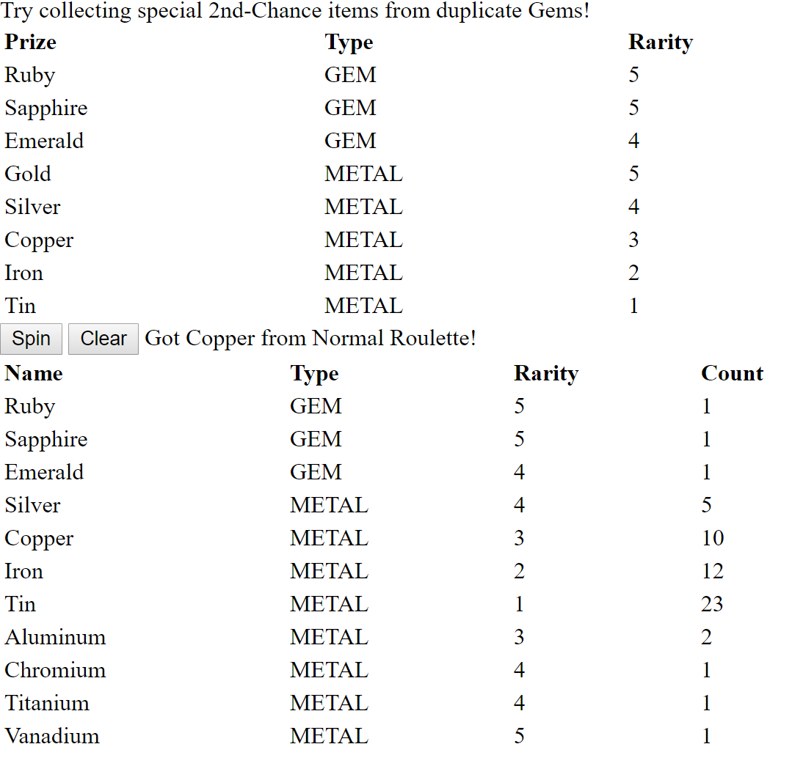

# roulette-simulator
Roulette Simulator in ASP.NET

# Introduction
This application simulates a roulette in games. A player can spin the roulette and get prizes (gems or metals) from it.  
Each prize has its displayed rarity and also an internal rate to determine the chance of being won in the total prize pool of a roulette.  
Some prizes (gems) are special that they can only be obtained once by one player. When they are won again, another roulette will be triggered with different prizes from the basic one.  
In the example, special metals like "Aluminum" and "Chromium" can only be obtained in this way by getting duplicate "Ruby", "Sapphire" or "Emerald"s.  

